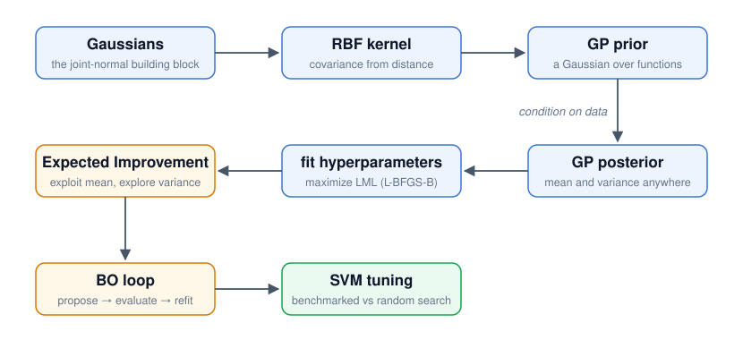
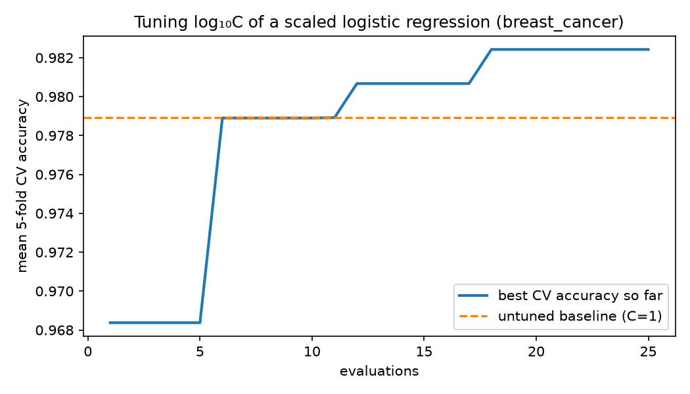
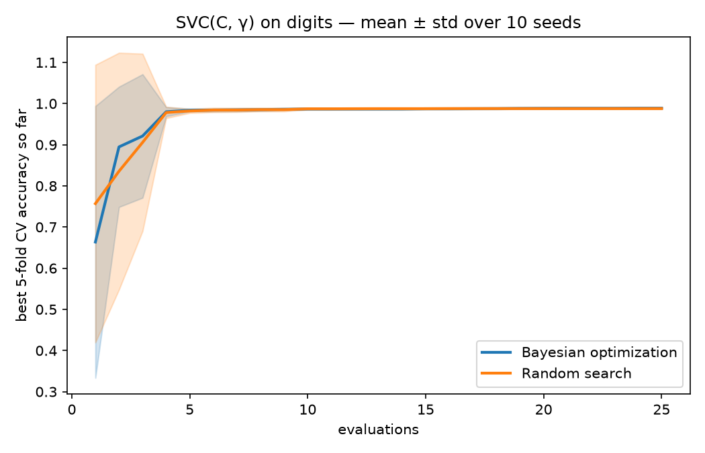
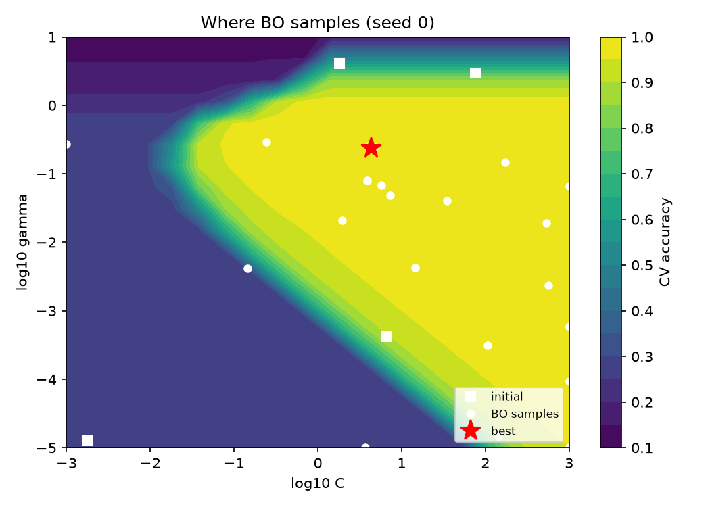
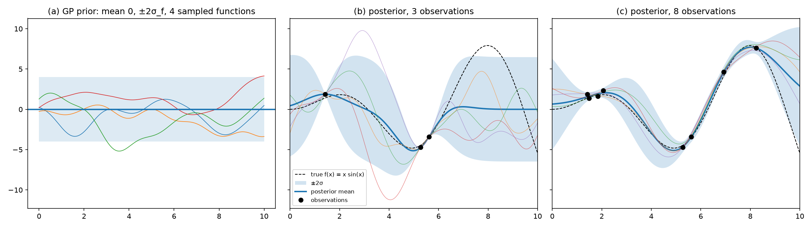
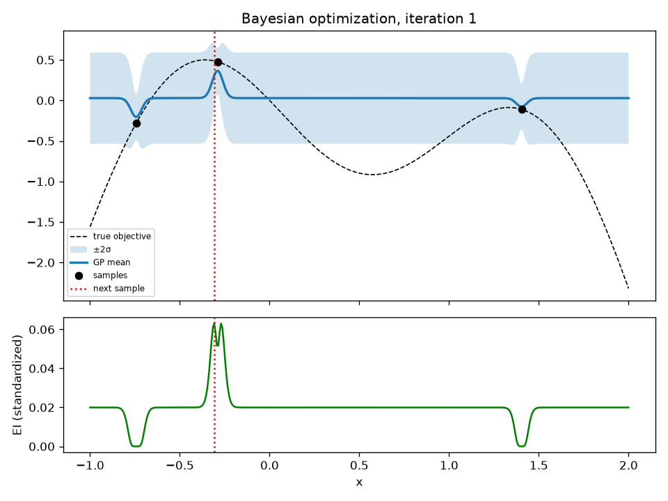
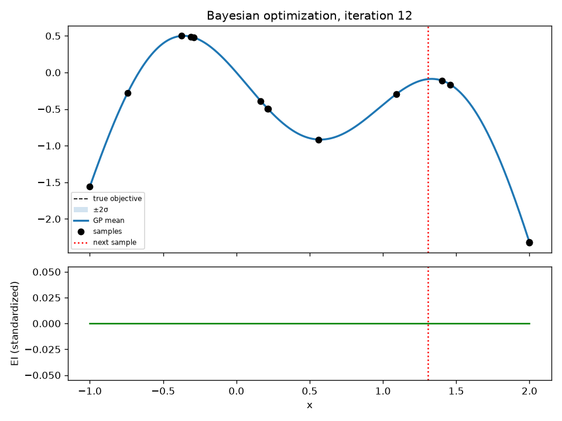
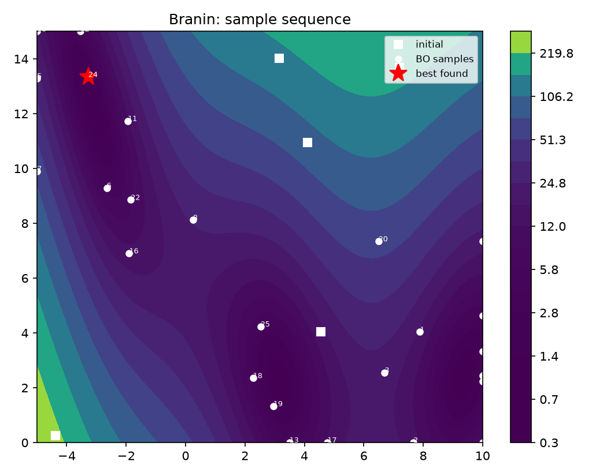

# Gaussian Processes + Bayesian Optimization from scratch

This is a Gaussian process regression and Bayesian optimization implemented in NumPy and SciPy. The project is exposed as one reusable call, `tune_model`, which tunes the hyperparameters of any scikit-learn estimator on any dataset provided. Every piece is validated: the GP against scikit-learn's, the acquisition function against a Monte-Carlo estimate, the optimizer against random search ([Correctness](#correctness) and [the benchmark](#the-benchmark-bo-vs-random-search-on-digits) have the numbers). This is a learning project: the code is annotated at derivation grade and comes with a [full math walkthrough](docs/math-walkthrough.md).

## The pipeline



The prior is a joint Gaussian over function values, with covariance supplied by the RBF kernel. Conditioning on observations gives the posterior mean and variance, and fitting the kernel hyperparameters means maximizing the log marginal likelihood. Expected Improvement turns the posterior into a score that balances exploiting the mean against exploring the variance; the BO loop repeatedly maximizes that score, evaluates the objective at the chosen point, and refits. The final experiment applies the loop to a real hyperparameter search and compares it to random search.

## Usage

`tune_model` takes three inputs: the data as numeric arrays, a factory that builds the estimator, and bounds for the parameters to tune. A small adapter (`src/gpbo/model_selection.py`) turns fixed-fold cross-validation into a black-box objective, and the GP/Expected-Improvement loop spends 25 evaluations (by default) finding the best parameters.

```python
import pandas as pd
from sklearn.linear_model import LogisticRegression
from sklearn.pipeline import Pipeline
from sklearn.preprocessing import StandardScaler

from gpbo import tune_model

df = pd.read_csv("my_data.csv")                    # (1) the dataset and its
X = df.drop(columns="outcome").values              #     target column
y = df["outcome"].values

def make_model(params):                            # (2) the estimator to tune
    return Pipeline([("scale", StandardScaler()),
                     ("logreg", LogisticRegression(C=10.0 ** params["log10_C"], max_iter=1000))])

result = tune_model(X, y, model_factory=make_model,
                    param_space={"log10_C": (-4.0, 4.0)},   # (3) the bounds to search
                    cv=5, seed=0)

result.best_params                       # {"log10_C": -0.35}; pass back into the factory
result.best_cv_score                     # best mean CV accuracy found
result.optimization_result.best_so_far   # best-so-far curve, for plotting
```

Adapting the snippet to another dataset means changing the three numbered parts: (1) the loading lines, which must produce numeric `X, y` arrays; (2) the factory, which can build any scikit-learn estimator from `params`; and (3) `param_space`, the bounds searched for each parameter. The other lines stay the same.

Interface summary:

```text
Inputs        numeric X, y · a model_factory(params) -> estimator ·
              param_space bounds · optionally cv, seed, scoring, n_init/n_iter
Returns       TuningResult: .best_params, .best_cv_score,
              .optimization_result (all evaluations + best-so-far curve)
Caller-side   the final fit (model_factory(result.best_params).fit(X, y)),
              plotting, and holding out a test set beforehand
```

The same data, arguments, and seed reproduce an identical run; `print(result)` prints a summary of the result.

Scope and requirements:

- Any scikit-learn estimator works (a `Pipeline` counts); the library does not select model types: comparing an SVM against a random forest, for example, is two `tune_model` calls and two scores.
- Parameter transforms such as `C = 10**log10_C` belong inside the factory, which keeps the GP searching a well-scaled space.
- `X, y` must already be numeric arrays; there is no CSV parsing, encoding, or missing-value handling.
- Bounds are continuous float ranges; categorical or conditional hyperparameters are out of scope.
- The CV folds are fixed for the whole run, so the objective is deterministic; scores are maximized (use sklearn's `neg_*` scorers to minimize a loss).

### A worked example: breast cancer

`experiments/generic_tuning_demo.py` is the code above run end to end on scikit-learn's built-in `breast_cancer` dataset (569 tumor samples, 30 numeric features, malignant/benign label). It finishes in seconds: on the committed run (seed 0), tuning raises a scaled logistic regression from the untuned `C = 1` baseline's `0.9789` mean 5-fold CV accuracy to `0.9824` at `C = 10^-0.35`:



## The benchmark: BO vs random search on digits

The demo above shows the interface; this experiment evaluates the optimizer itself. A single tuning run takes under a minute; this script runs twenty of them (10 seeds × {Bayesian optimization, random search} = 500 evaluations, all driven through `build_cv_objective`, the layer underneath `tune_model`), which is why it takes ~15 minutes: the result is a seed-averaged comparison with error bars rather than a single run.

Tuning `SVC(C, γ)` on scikit-learn's digits dataset. Search space is `log₁₀C ∈ [-3, 3]`, `log₁₀γ ∈ [-5, 1]`; the objective is mean 5-fold stratified CV accuracy on an 80% pool. Each method gets 25 evaluations per seed, averaged over 10 seeds. A held-out 20% test set is touched once per method at the end.



| checkpoint | BO (mean best CV acc) | Random search (mean best CV acc) |
|---|---|---|
| after 5 evals | 0.9837 | 0.9820 |
| after 10 evals | 0.9867 | 0.9872 |
| after 25 evals | 0.9887 | 0.9877 |

Held-out test accuracy of each method's overall-best config:

```
BO best config: C=10^0.38, gamma=10^-0.91  -> held-out test accuracy 0.9889
RS best config: C=10^0.34, gamma=10^-0.60  -> held-out test accuracy 0.9889
```

**Interpretation.** BO leads at 5 evaluations, random search is marginally ahead at 10 (`0.9872` vs `0.9867`), and BO is ahead again at 25. The first 5 evaluations of both methods are random points (BO has not yet used its GP), so the 5-eval gap is partly seed variance, and the numbers stay within a fraction of a percent of each other throughout. This is the expected behavior on an easy, well-bounded 2D landscape with a broad high-accuracy plateau: random search is competitive here, and both methods find configs that tie at `0.9889` on held-out test. BO's advantage is sample efficiency early, and it grows on more expensive or more structured objectives where every evaluation is costly. Where BO concentrates its samples on the CV-accuracy landscape:



## Under the hood: GP regression and synthetic BO

Before any real tuning, the building blocks are exercised on problems where the truth is known: GP regression on a toy function, then BO on synthetic objectives.

### GP regression

Prior samples, then the posterior after 3 and 8 noisy observations of `f(x) = x sin(x)`, with hyperparameters fitted by maximizing the LML. The `±2σ` band collapses near data and widens back to the prior away from it.



### 1D Bayesian optimization

Two frames from a 12-iteration run maximizing `-sin(3x) - x² + 0.7x`. Top panel: true objective, GP mean, `±2σ`, samples so far, and the next point (red). Bottom panel: the EI surface whose argmax picks that next point. In the early frame EI is highest in the uncertain regions; by the late frame the posterior has converged near the optimum and EI has flattened.

| Iteration 1 (early) | Iteration 12 (late) |
|---|---|
|  |  |

### 2D Bayesian optimization (Branin)

Sample placement over the Branin function (three global minima). The optimizer concentrates its evaluations in one minimum's basin. On the committed seed-0 run it reached a best value of `1.038` against the true global minimum of `0.398`; other seeds landed in the `0.46`–`0.72` range. The figure shows basin concentration, not convergence to the global minimum.



## What is implemented from scratch

- **RBF kernel:** `k(x, x') = σ_f² exp(-‖x - x'‖² / 2ℓ²)`, with the squared-distance expansion done without an `(n, m, d)` intermediate (`src/gpbo/kernels.py`).
- **GP posterior via Cholesky:** `α = K⁻¹y` through `cho_solve` (never an explicit inverse), predictive variance from triangular solves, jitter escalation for stability (`src/gpbo/gp.py`).
- **Log marginal likelihood + multi-start fitting:** the LML in closed form using the Cholesky factor for `log|K|`, maximized over `(ℓ, σ_f², σ_n²)` in log space with multi-start L-BFGS-B; the current point is always kept as a candidate so the fit never worsens the starting LML (`src/gpbo/gp.py`).
- **Expected Improvement:** the closed form `EI = I·Φ(z) + σ·φ(z)`, with the `σ→0` point-mass case handled explicitly (`src/gpbo/acquisition.py`).
- **BO loop:** standardization of `y`, input scaling to `[0,1]^d`, warm-started hyperparameters across iterations, grid EI maximization in 1D and candidate + L-BFGS-B refinement in higher dimensions, plus a duplicate guard so the loop cannot stall re-evaluating a point (`src/gpbo/optimizer.py`).

Delegated to the numerical libraries: dense linear algebra primitives (`scipy.linalg.cholesky`, `cho_solve`, `solve_triangular`), the L-BFGS-B optimizer (`scipy.optimize.minimize`), and the standard-normal `pdf`/`cdf` (`scipy.stats.norm`). The experiments use scikit-learn for the digits data and the SVM, and for the reference `GaussianProcessRegressor` in the agreement tests.

## Correctness

The benchmark above measures how well the assembled optimizer performs; this section verifies that the components underneath compute the correct quantities. Each piece implemented from scratch is checked against an independent reference, and the checks run as part of the test suite:

- **GP agreement with scikit-learn:** at fixed hyperparameters, the posterior mean, posterior std, and log marginal likelihood match `GaussianProcessRegressor` to `atol 1e-6`. Measured agreement is around `1e-9`; the demo script prints the observed `max|Δmean|` and `max|Δstd|`.
- **EI against Monte Carlo:** the closed-form EI is checked against the mean of `100,000` draws from `N(μ, σ²)` passed through `max(f - y_best - ξ, 0)`, agreeing to `rtol 2e-2`.

```
$ uv run pytest
37 passed
```

## Quick start

```bash
uv sync
uv run pytest                                      # the full test suite, seconds
uv run python experiments/generic_tuning_demo.py   # end-to-end tuning demo, seconds
```

## Limitations

- **`O(n³)` scaling.** The Cholesky factorization is cubic in the number of observations, which is sufficient for the tens-to-hundreds of points a BO run accumulates but rules out large-`n` regression without sparse or inducing-point approximations.
- **Low-dimensional scope.** Everything here is exercised in 1–3 dimensions. EI over a box gets progressively harder to maximize as dimension grows, and this repo does not implement the trust-region or high-dimensional acquisition machinery that addresses it.
- **Noisy-EI caveat.** EI uses the best *observed* `y` as its incumbent. Under observation noise the true incumbent is uncertain, and plain EI can be over-optimistic; a noise-aware acquisition (e.g. expected improvement over the posterior mean, or knowledge gradient) would be the principled fix.
